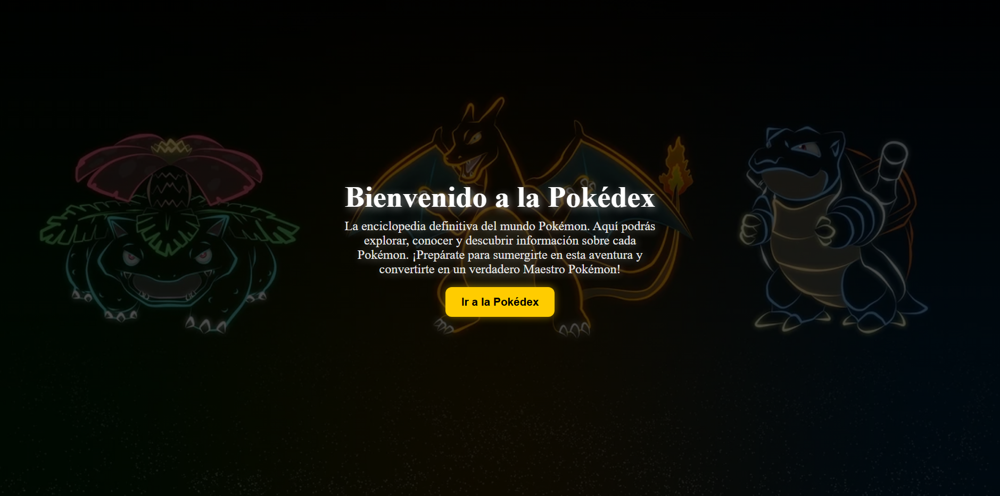

# Pokédex

## Descripción:

Pokédex es una aplicación web que permite explorar una base de datos de Pokémon, mostrando detalles como nombre, tipo, habilidades y estadísticas de cada pokemon. 

## ¿que se uso?

HTML5 - Para la estructura de la aplicación.

CSS3 - Para los estilos y la presentación visual.

React y typescript - Para la lógica y la interactividad.

API de Pokémon (PokeAPI) - Para obtener los datos en tiempo real.

GitHub  Para el despliegue.

## Paso a paso:

### 1. Clonar el repositorio: 
git clone https://github.com/DavidRodriguez-22/Pokedex.git
cd Pokedex

### 2. Ejecutar con un servidor local gracias a react
npm install  //Instalar dependencias
npm run dev  //Ejecutar en desarrollo

## Caracteristicas principales de nuestra aplicacion

-Búsqueda de Pokémon por nombre o ID.

-Interfaz atractiva y responsiva.

-Visualización de habilidades y estadísticas.

-Integración con la API de Pokémon.

## Fotos de la aplicacion

### Pantalla de inicio:

### Pokedex:

### Busqueda:

### Filtrado:

### Detalles pokemon:

## url publica del proyect0

url: https://pokedex-xi-black.vercel.app/
